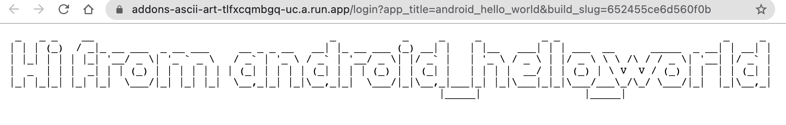

# ASCII Art Bitrise demo addon

This addon is used for demo purposes to illustrate the addons integration flow. We'll keep this up-to-date with latest changes.



This addon gets an addon API token and use this to request Bitrise API for the current app name. Finally displays it in an ASCII art way.

The required addon endpoints are located in [app.ts file](./src/app.ts).

## Usage

### Development

1. Run `yarn install`
1. Export envs: `CLIENT_ID` and `CLIENT_SECRET` (and optionally PORT, BITRISE_BASE_URL)
1. Run `yarn dev`

or

1. Configure your .bitrise.secrets.yml:
    ```
    envs:
    - CLIENT_ID: ...
    - CLIENT_SECRET: ...
    - PORT: ... (optional)
    - BITRISE_BASE_URL: ... (optional)
    ```
1. Run `bitrise run up`

The service should be ready now. You can try running command: `curl localhost:3000` to see if the service responds.

## Provisioning

```
curl -X POST 'http://localhost:3000/provision' --header 'Authorization: Bearer <subject_token>'
```
